# 1. Different Tiers in Software Architecture

### What is a tier?

Think of a tier as both logical and physical separation of components in an application or a service. This separation is at a component level, not the code level.

<b>components?</b>
* Database
* Backend application server
* User Interface
* Messaging
* Caching etc.

## Single-Tier Application

> In a single-tier application, the user interface, backend business logic, and the database reside in the same machine.

 

  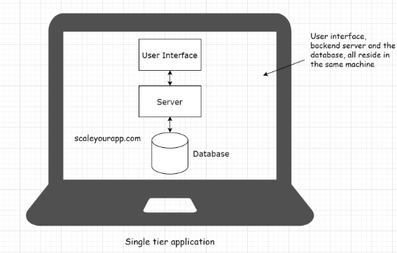
   
  <code>Example: MS Office, Pc Games, Gimp, Photoshop etc</code>

 

## Two-Tier Application

> A two-tier application involves a client and a server. The client contains the user interface with the business logic in one machine. Meanwhile, the backend server includes the database running on a different machine. The database server is hosted by the business and has control over it.

 
  

    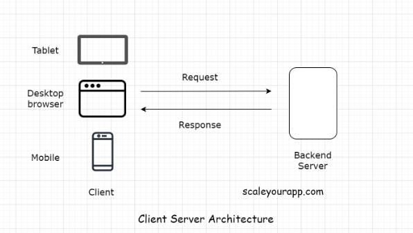
  

 

## Three-Tier Application

> In a three-tier application, the user interface, business logic, and the database all reside on different machines and, thus, have different tiers. They are physically separated.

 

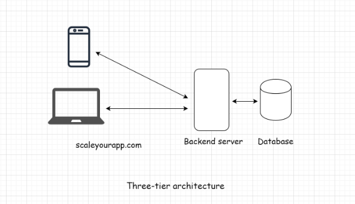

 

## N-tier applications

> An n-tier application is an application that has more than three components (user interface, backend server, database) involved in its architecture.

<b>components ?</b>

* Cache
* Message queues for asynchronous behavior
* Load balancers
* Search servers for searching through massive amounts of data
* Components involved in processing massive amounts of data
* Components running heterogeneous tech commonly known as web services, microservices, etc.

<b>All the social applications, large-scale consumer services like Uber, Airbnb</b>

### Difference between layers & tiers

> <strong>Note: </strong> Don’t confuse tiers with the layers of the application. Some prefer to use them interchangeably. However, in the industry, application layers typically mean the user interface, business, service and the data access layers.

 
  

    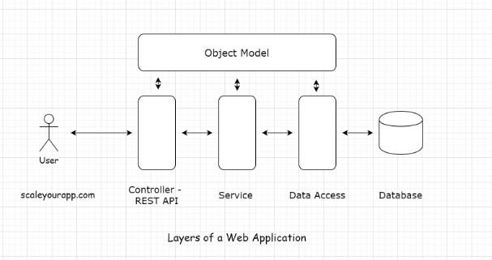
  

 

# 2. Web Architecture

Web architecture involves multiple components like a database, message queue, cache, user interface, etc., all running in conjunction to form an online service.

 

  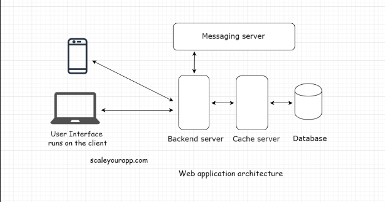

 

## Client

Web architecture involves multiple components like a database, message queue, cache, user interface, etc., all running in conjunction to form an online service.

 

  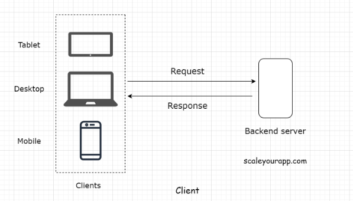

 

## Types of Clients

### Thin client

A thin client is a client that holds just the user interface of the application. It contains no business logic of any sort. For every action, the client sends a request to the backend server, just like in a three-tier application.

 

  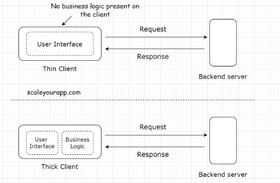

 

### Thick client

On the contrary, the thick client holds all or some part of the business logic. These are the two-tier applications. We’ve already been through them.

## Server

> The primary task of a web server is to receive the requests from the client and provide the response after executing the business logic based on the request parameters received from the client.

* Proxy server
* Mail server
* File server
* Virtual server
* Data storage server
* Batch job server and so on

 

The server configuration and the type can differ depending on the use case. For instance, if we run a backend application code written in Java, we would pick Apache Tomcat or Jetty. For simple use cases such as hosting websites, we would pick the Apache HTTP Server.

## REST API and API Endpoints

> <strong>Note:</strong> If you aren’t aware of the REST API and the API Endpoints, we will discuss it in the next lesson in detail. I’ve brought up the terms in this lesson just to give you a heads up on how modern distributed web applications communicate.

 

  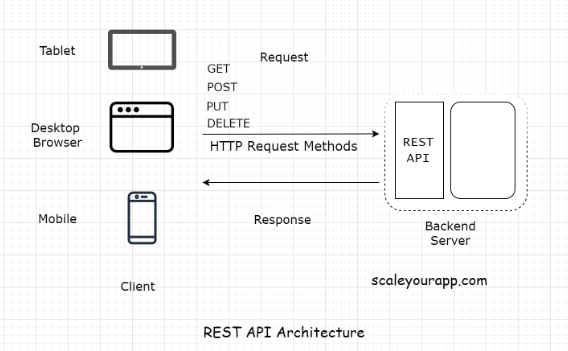

 

## What is a REST API?

> REST stands for Representational State Transfer. It’s a software architectural style for implementing web services. Web services implemented using the REST architectural style are known as the RESTful web services.

 

  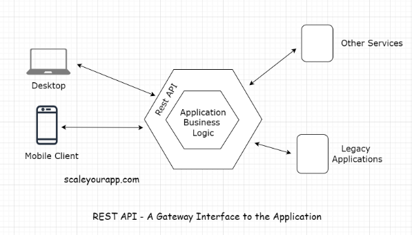

 

## HTTP Pull - Polling With AJAX

> AJAX stands for Asynchronous JavaScript and XML. The name says it all. AJAX is used for adding asynchronous behavior to the web page.

 

  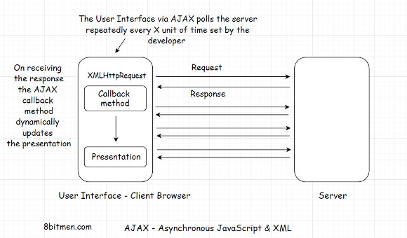

 

instead of requesting the data manually every time with the click of a button, AJAX enables us to fetch the updated data from the server by automatically sending the requests over and over at stipulated intervals.

> It is important to note here that AJAX polling and AJAX Long polling are different techniques. Do not confuse them as one.

> AJAX polling is the HTTP Pull mechanism and AJAX Long polling is a hybrid between the HTTP Push and the Pull, based on the BAYEUX protocol. I’ve discussed it in the HTTP Push-based technologies lesson.

## HTTP Push

> A persistent connection is a network connection between the client and the server that remains open for future requests and responses, as opposed to being closed after a single communication.

 

  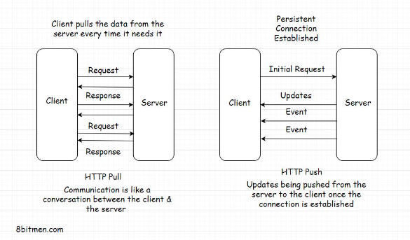

 

## HTTP Push-Based Technologies

### Web Sockets

A Web Socket connection is preferred when we need a persistent bi-directional low latency data flow from the client to the server and back.

Typical use-cases of web sockets are messaging, chat applications, real-time social streams, browser-based massive multiplayer games, etc. These are apps with quite a significant number of read writes compared to a regular web app.

### AJAX - Long Polling

Long polling lies somewhere between AJAX and Web Sockets. In this technique, instead of immediately returning the empty response, the server holds the response until it finds an update to be sent to the client.

### HTML5 Event-Source API and Server-Sent Events

The Server-Sent Events (SSE) implementation takes a different approach. Instead of the client polling for data, the server automatically pushes the data to the client whenever the updates are available. The incoming messages from the server are treated as events.

### Streaming over HTTP

Streaming over HTTP is ideal for cases where we need to stream extensive data over HTTP by breaking it into smaller chunks. This is made possible with HTML5 and a JavaScript Stream API.

 

  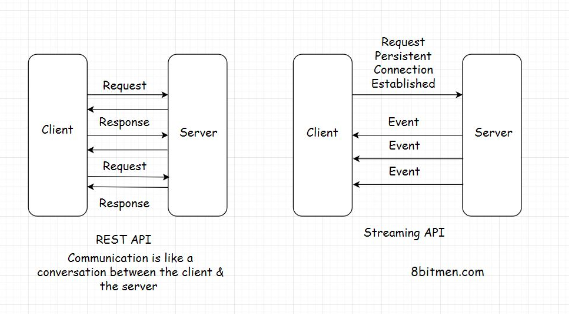

 

# 3. Scalability?

Scalability means the application’s ability to handle and withstand increased workload without sacrificing performance.

For example, if your app takes x seconds to respond to a user request. It should take the same x seconds to respond to each of your app’s million concurrent user requests.

The app’s back-end infrastructure should not crumble under a load of a million concurrent requests. It should scale well when subjected to a heavy traffic load and maintain the system’s latency.

 

  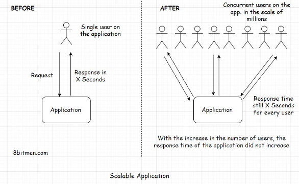

 

### What's latency?

Latency is the time a system takes to respond to a user request. Let’s say you send a request to an app to fetch an image and the system takes 2 seconds to respond to your request. The latency of the system is 2 seconds.

### Measuring latency

Latency is measured as the time difference between the action that a user takes on the website and the system’s response in reaction to that action. The action can be an event like clicking a button, scrolling down a web page, etc.

This latency is generally divided into two parts:

* Network latency
* Application latency

 

  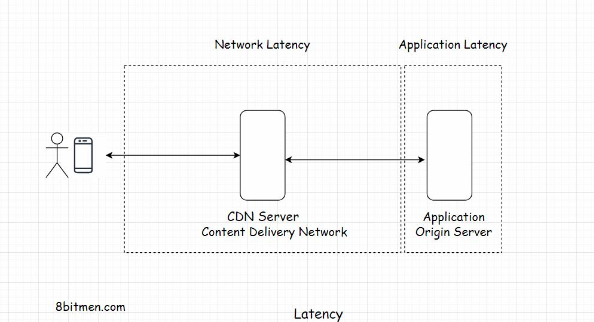

 

<b>Network latency is the time that the network takes to send a data packet from point A to point B. The network should be efficient enough to handle the increased traffic load on the website. To cut down the network latency, businesses use a CDN (Content Delivery Network) to deploy their servers across the globe as close to the end-user as possible. </b>

#### Application latency

Application latency is the time the application takes to process a user request. There are more than a few ways to cut down the application latency. The first step is to run stress and load tests on the application and scan for the bottlenecks that slow down the system as a whole. I’ll talk more about it in the upcoming lessons.

## Types of Scalability

To scale well, an application needs solid computing power. The servers should be powerful enough to handle increased traffic loads.

There are two ways to scale an application:

* Vertically
* Horizontally

 

  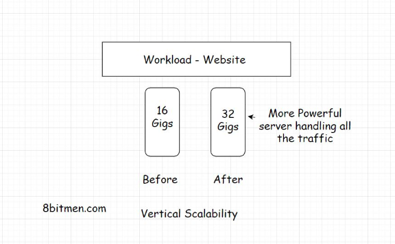

 

Vertical scaling means adding more power to our server. Let’s say our app is hosted by a server with 16 gigs of RAM. To handle the increased load, we now augment the RAM to 32 gigs. Here, we have vertically scaled the server.

 

  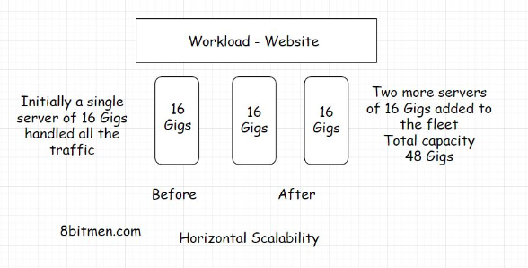

 

# 4. High Availability?

> High availability, also known as HA, is the ability of the system to stay online despite having failures at the infrastructural level in real-time.

### How important is high availability to online services?

Social applications going down for a bit and then bouncing back might not impact businesses that much. However, there are mission-critical systems like aircraft systems, spacecrafts, mining machines, hospital servers, and finance stock-market systems that cannot afford to go down at any time. After all, lives depend on it.

### Achieving High Availability - Fault Tolerance

> Fault tolerance is a system’s ability to stay up despite taking hits.

So, to achieve high availability at the application level, the entire massive service is architecturally broken down into more granular loosely coupled services called microservices.

 

  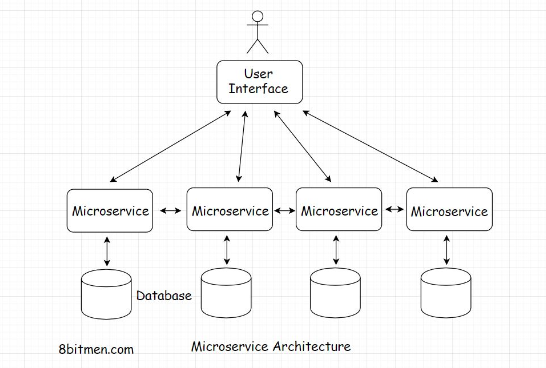

 

* Easy management and maintenance
* Ease of development
* Ease of adding new features to a service without affecting other services
* Scalability and high availability of the system

## Redundancy

### Redundancy – Active-passive HA mode

> Redundancy is duplicating the server instances and keeping them on standby to take over in case any of the active server instances go down. It is the fail-safe backup mechanism in the deployment infrastructure.

 

  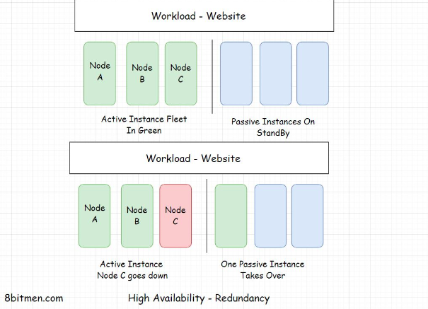

 

The illustration above shows the redundant instances. One of the redundant instances takes over when the active instance goes offline.

## Replication

Replication means having a number of similar nodes running the workload together. There are no standby or passive instances. When a single or a few nodes go down, the remaining nodes bear the load of the service.

### Replication – Active-active HA mode

 

  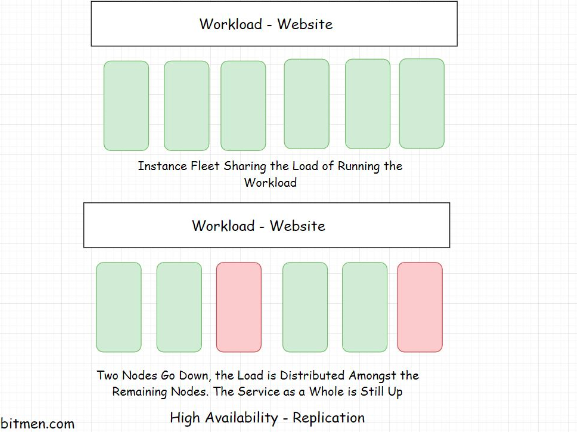

 

# 5. Load Balancing

Load balancing enables our service to scale well and stay highly available when the traffic load increases. Load balancing is facilitated by load balancers, making them a key component in the web application architecture.

 

  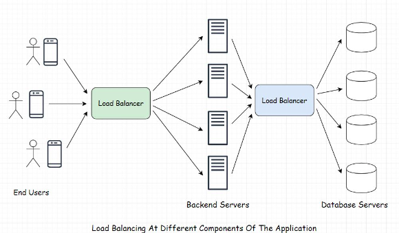

 

## Understanding DNS

Every machine that is online and is a part of the World Wide Web (WWW) has a unique IP address that enables it to be contacted by other machines on the web using that particular IP address.

### How does a domain name system work?

When a user types in the URL of the website in their browser and hits enter, this event is known as DNS querying.

Four key components, or a group of servers, make up the DNS infrastructure. These are:

* DNS Recursive nameserver aka DNS Resolver
* Root nameserver
* Top-Level Domain nameserver
* Authoritative nameserver

 

  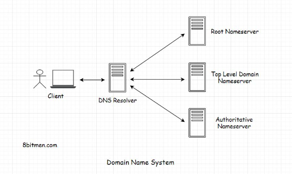

 

This is how the entire DNS query lookup process works.

  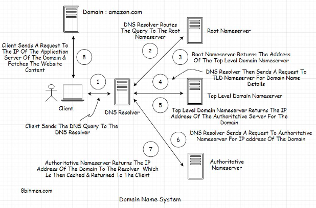

 

## DNS Load Balancing

 

  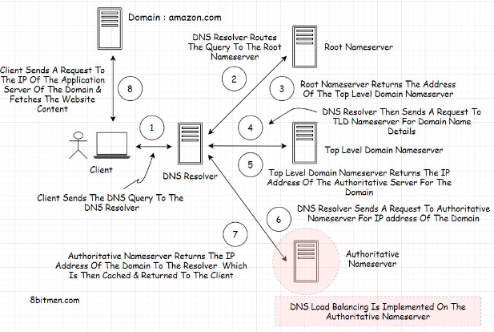

 

DNS load balancing enables the authoritative server to return different IP addresses of a particular domain to the clients. Every time it receives a query for an IP, it returns a list of IP addresses of a domain to the client.

With every request, the authoritative server changes the order of the IP addresses in the list in a round-robin fashion.

## Load Balancing Methods

# 6. Database

## Introduction and Types of Data

A database is a component in application architecture required to persist data. Data can be of many forms: structured, unstructured, semi-structured, and user state data.

### Structured data

Structured data is the most easy to work with since it does not need any sort of data preparation before we can interact with it.

An example of this type of data is the details of a customer stored in a database row. The customer Id would be of integer type, the name would be of string type with a certain character limit, age would be of integer type and so on.

Every column of the database row has some pre-defined rules for the data that is meant to be persisted in it. With structured data, we know what we are dealing with. Since the customer name is strictly of string type, we can run string operations on it without worrying about errors or exceptions.

Structured data is typically managed by a query language such as SQL (Structured query language).

### Unstructured data

Unstructured data has no definite structure. It is the heterogeneous type of data consisting of text, image files, videos, multimedia files, pdfs, blob objects, word documents, machine-generated data, etc.

We generally have to deal with this kind of data when running data analytics. In a data analytics architecture, the data streams in from multiple sources such as IoT devices, social networks, web portals, industry sensors, etc., into the analytics system.

We cannot directly interact with unstructured data. The initial data collected is pretty raw. We have to make it flow through a data preparation stage that segregates it based on business logic and then analytics algorithms are run to extract meaningful information.

 

  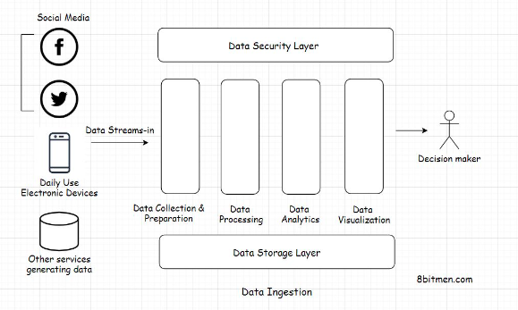

 

## NoSQL Databases - Introduction

As the name implies, NoSQL databases have no SQL; they are more like JSON-based databases built for Web 2.0

NoSQL databases are built for high-frequency read writes, typically required in social applications like micro-blogging, real-time sports apps, online massive multiplayer games, and so on.

### Scalability

Well, one big limitation with SQL-based relational databases is scalability. Scaling relational databases is not trivial. They have to be sharded, replicated to make them run smoothly on a cluster. This requires careful planning, human intervention and a skillset.

On the contrary, NoSQL databases can add new server nodes on the fly and scale without any human intervention, just with a snap of your fingers.

Today’s websites need fast read-writes. There are billions of users connected with each other on social networks. A massive amount of data is generated every microsecond, and we need an infrastructure designed to manage this exponential growth.

## Polyglot Persistence

> Polyglot persistence means using several distinct persistence technologies such as MySQL, MongoDB, Memcache, Cassandra, etc., together in an application to fulfill its different persistence requirements.

 

  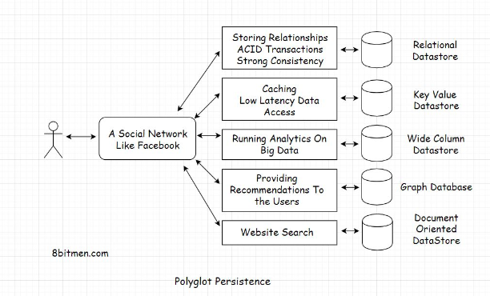

 

## Multi-Model Databases

Multi-model databases support multiple data models like the graph, document-oriented, relational, etc. They also avert the need for managing multiple persistence technologies in a single service. They reduce the operational complexity by notches. With multi-model databases, we can leverage different data models via a single API.

 

  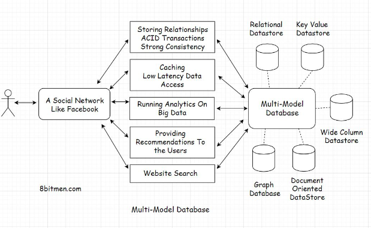

 

## Eventual Consistency

Eventual consistency is a data consistency model that enables the datastores to be highly available. It is also known as optimistic replication and is key to distributed systems.

### Real-world use case

Think of a popular microblogging site deployed worldwide in different geographical regions like Asia, America, Europe, etc. Each geographical region has multiple data center zones: North, East, West, and South. And each of these data center zones has multiple clusters with numerous server nodes running.

 

  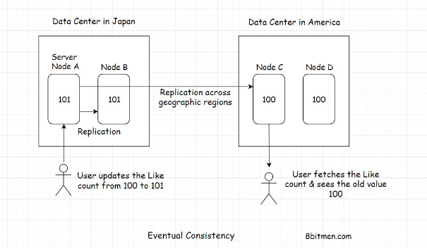

 

## Strong Consistency

Strong consistency simply means the data has to be strongly consistent at all times; all the server nodes across the world should contain the same value of an entity at any point in time. The only way to implement this behavior is by locking down the nodes as they are being updated.

 

  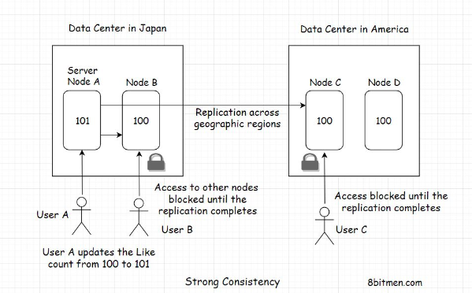

 

## Types of Databases

There are numerous types of databases that are available to the application developers, catering to specific use cases. These are:

### Document-oriented database

> Document-oriented databases are the leading types of NoSQL databases. They store data in a document-oriented model in independent documents. The data is generally semi-structured and stored in a JSON-like format.

### Graph Database

Graph databases are a part of the NoSQL family. They store data in nodes/vertices and edges in the form of relationships. Each node in a graph database represents an entity, it can be a person, a place, a business, etc., and the edge represents the relationship between the entities.

 

  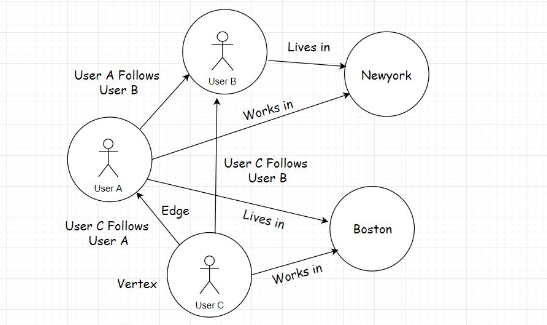

 

#### Real-world use cases of graph databases

#### Modeling relationships between users in social networks

 

  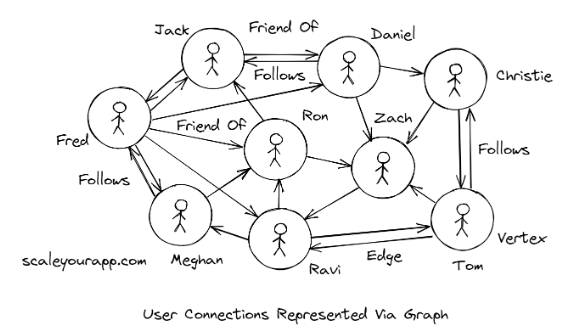

 

#### Google maps is one big graph

In Google Maps, nodes represent cities, and the edges are the roads between these cities. The nodes could further represent places in a city, intersections, and even houses. The entire application is one big map that heavily uses graph theory to find the shortest distance between the two places.

  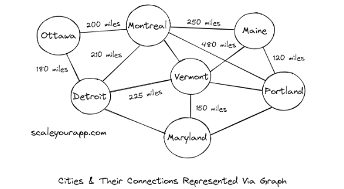

 

In graph theory, based on the use case, different algorithms are used to calculate the shortest path between two nodes. A few of the popular ones are Dijkstra’s algorithm, Bellman-Ford algorithm, A* search algorithm, Floyd–Warshall algorithm, Johnson’s algorithm, and the Viterbi algorithm.

### Key-Value Database

Key-value databases are also a part of the NoSQL family. These databases use a simple key-value pairing method to store and quickly fetch the data with minimum latency.

#### Features of a key-value database

Due to the minimum latency they ensure, that is constant O(1) time, the primary use case for these databases is caching application data.

The key serves as a unique identifier and has a value associated with it. The value can be as simple as a string and as complex as an object graph.

The data in key-value databases can be fetched in constant time O(1), and there is no query language required to fetch the data. It’s just a simple no-brainer fetch operation. This ensures minimum latency.

As discussed earlier in the course, these databases are also used to achieve a consistent state in distributed systems.

### Time Series Database

Time-series databases are optimized for tracking and persisting data that is continually read and written in the system over a period of time.

#### Why store time-series data?

Studying data streaming-in from applications helps us track the behavior of the system as a whole. It allows us to study user patterns, anomalies, and how things change over time.

Time-series data is primarily used for running analytics and deducing conclusions. It helps the stakeholders make future business decisions by looking at the analytics results. Running analytics enables us to evolve our product continually.

Regular databases are not built to handle time-series data. With the advent of IoT, these databases are getting pretty popular and adopted by the big guns in the industry.

### Wide-Column Database

Wide-column databases belong to the NoSQL family of databases and are primarily used to handle massive amounts of data, technically called Big Data.

Wide-column databases are perfect for analytical use cases. They have a high performance and a scalable architecture.

Also known as column-oriented databases, wide-column databases store data in a record with a dynamic number of columns. A record can hold billions of columns.

#### When To Pick a wide-column database

If you have a use case where you need to grapple with Big Data, a wide-column database would fit best.

Wide-column databases are built to manage Big Data, ensuring scalability, performance, and high availability.

# 7. Message Queue

## Introduction to Message Queues

> A message queue, as the name says, is a queue that routes messages from the source to the destination or the sender to the receiver following the FIFO (First in, first out) policy.

 

  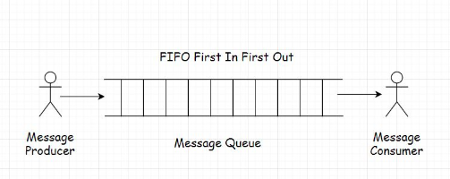

 

### Features of a message queue

Message queues facilitate asynchronous behavior. We have already learned what asynchronous behavior is in the AJAX lesson. Asynchronous behavior allows the modules to communicate in the background without hindering their primary tasks.

Message queues facilitate cross-module communication, which is key in service-oriented and microservices architecture. They enable communication in a heterogeneous environment, providing temporary storage for storing messages until they are processed and consumed by the consumer.

## Publish-Subscribe Model

> A publish-subscribe model, aka pub-sub, is a model that enables a single or multiple producers to broadcast messages to multiple consumers.

 

  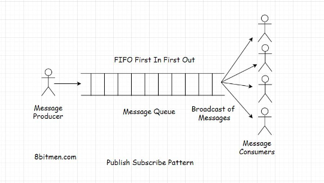

 

## Point-to-Point Model

> In a point-to-point model, a message from the producer is consumed by only one consumer.

 

  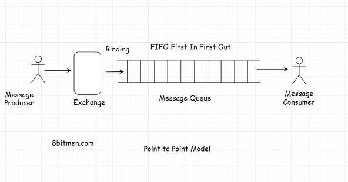

 

# 8. More on architecture

## Event-Driven Architecture

When writing modern Web 2.0 applications, chances are you have come across terms like reactive programming, event-driven architecture and concepts like blocking and non-blocking.

#### What is blocking?

In web applications blocking means, the flow of code execution is paused while waiting for a process to complete. Until the process completes, it cannot move on.

#### What is non-blocking?

In the non-blocking approach, the flow doesn’t wait for the external function that is called to return the response. It just moves on to execute the following lines of code. This approach is a little inconsistent compared to the blocking approach since the external function might not return anything or throw an error. Still, the following code in the sequence is executed.

#### What are events?

There are typically two kinds of processes in applications: CPU intensive and IO intensive. In the context of web applications, IO means events. A large number of IO operations mean a lot of events occurring over a period of time, and an event can be anything from a tweet to a click of a button, an HTTP request, an ingested message, a change in the value of a variable, and so on.

#### Event-driven architecture

They are capable of handling a big number of concurrent connections with minimal resource consumption. Modern applications need a fully asynchronous model to scale. These modern web frameworks provide more reliable behavior in a distributed environment. They are built to run on a cluster, handle large-scale concurrent scenarios, and tackle problems that generally occur in a clustered environment. They enable us to write code without worrying about handling multi-threads, thread lock, out-of-memory issues due to high IO, etc.

 

  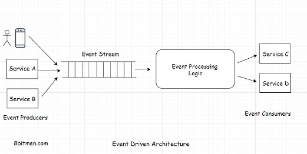

 

## Webhooks

Webhooks are more like call-backs. It’s like, “I will call you when new information is available. You carry on with your work.”

Webhooks enable communication between two services without the middleware. They have an event-based mechanism.

## Hexagonal Architecture

<b>The hexagonal architecture consists of three key components:</b>

* Ports
* Adapters
* Domain

The focus of this architecture is to make components of an application: independent, loosely coupled, and easy to test.

The application should be designed in a way such that it can be tested by both humans and automated tests, with and without a UI, with mock databases and mock middleware, without making any changes or adjustments to the code.

 

  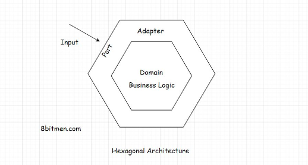

 

## Peer-to-Peer Architecture

Peer-to-peer (P2P) architecture is the base of blockchain tech. We’ve all used it at some point in our lives to download files via torrent. So, I guess you have a little idea of what it is. You are also probably familiar with terms like seeding, leeching, etc. Even if you aren’t, you’ll learn everything in this lesson.

 

  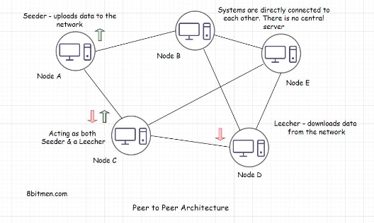

 

# 9. Mobile Apps

## Before You Design Your Mobile App

#### Mobile Only

Mobile-only means that the business operates just via mobile. It may have a mobile website or an app on the play store or both. Generally, it’s the apps that the businesses move forward with when going mobile-only which drive most of the traffic.

#### Mobile First

Mobile-first means the service’s user interface is designed with the idea that most of the business’s users will use its services via its mobile client. The desktop-based website interface is secondary. The mobile interface is the interface that a business would want to show to its customers first as opposed to its desktop interface.

#### Mobile friendly – Responsive

Mobile-friendly as the name implies, are websites that are friendly for mobile but are originally built to render on desktop browsers. They are popularly known as responsive websites. They have a grid-based design and adapt themselves based on the screen size of the device. We can also call these websites web-first or desktop-first.

 

  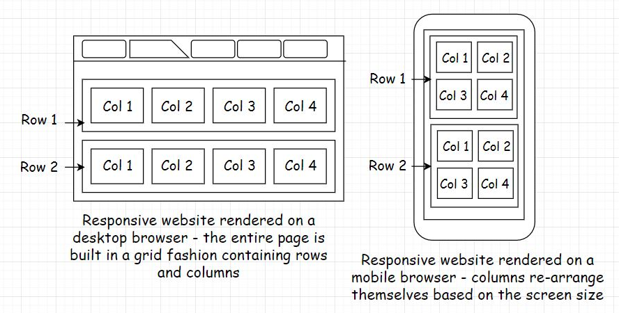

 

## Types of mobile apps

There are two types of mobile apps: native and hybrid. In this lesson, we’ll find out what they are and what technologies are required to build these apps. In the subsequent lessons, we’ll also discuss things like:

### Native app

Native apps are apps that are built exclusively for a certain operating system; it can be Android, iOS or Windows-based handheld device OS.

These apps function only on the OS they are built for. For instance, an app built for Android OS will not work on Apple OS.

Native apps interact directly with the operating system and the device hardware as opposed to communicating with it via a wrapper, an adapter or a middle layer. Therefore, they have full access to the device hardware like camera, sensors, and so on.

These apps provide high performance, have a consistent user interface, providing the look and feel of the native OS.

 

  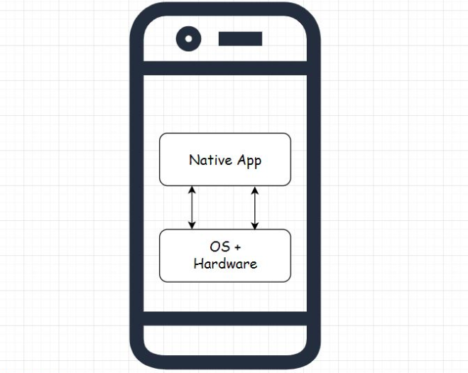

 

### Hybrid app

As the name implies, hybrid apps are a hybrid between the native and the web-based technologies. Like native apps, they can be installed from the app stores on the mobile, can access the hardware of the device, and can also communicate with the device’s OS.

Hybrid apps are primarily built using open web-based technologies such as Html5, CSS, and JavaScript. They run in a native container and communicate with the native OS via a wrapper or a middle layer. This middle layer enables open web technologies to talk to the native OS.

Now, because of this additional middle layer, which native apps don’t have, hybrid apps are a bit slower than native apps in performance and rendering the UI.

 

  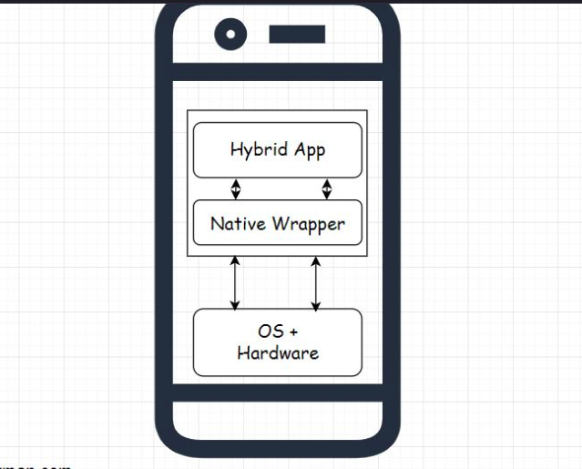

 

## Progressive Web Apps

Progressive web apps or PWAs are apps having the look and feel of native apps that can run in both mobile and desktop browsers. They can be installed on the user’s device right from the browser as opposed to the app stores. When installed on the device, progressive web apps run in their own window without an address bar or a browser tab, just like native apps. When we open a PWA in the browser tab, we see the install option with a plus sign in the address bar. Clicking on it will install the app on our device with a shortcut on the home screen.

 

  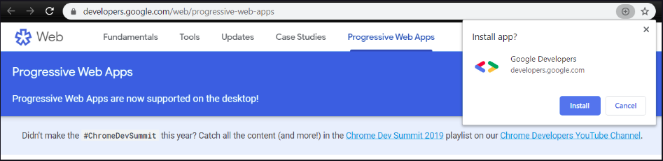

 

## Mobile Backend as a Service

Mobile Backend as a Service or MBaaS is a cloud-based service model that takes care of the backend infrastructure of our mobile app, enabling us to focus on the business logic and the user interface.

 

  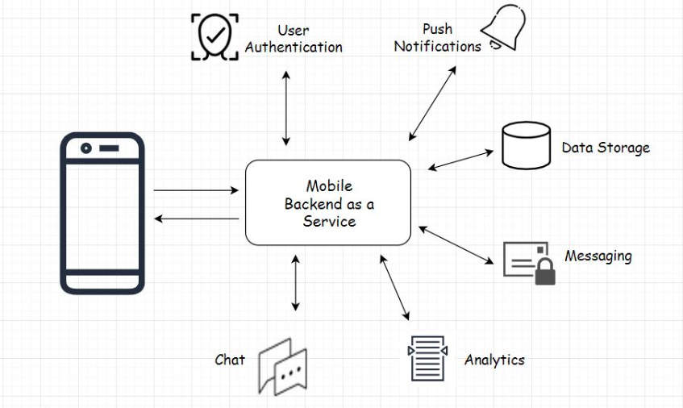

 

An MBaaS takes care of all these features making a developer’s life a lot easier during the bootstrapping phase. Imagine writing and maintaining all these features yourself from the bare bones. I mean, it’s not even possible unless you have a team.

MBaaS is best for apps like mobile games, messaging apps, and to-do list kinds of apps. When using MBaaS, there are a few things that you should keep in mind. Since we don’t have much control over the backend, we always have to keep the business logic on the client. This is one and another is. If we ever need to add a new feature that would require the business logic to be on the server, we will have to design a custom backend from the bare bones.

 

  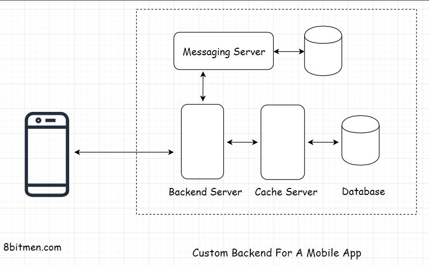

 

* Custom Backend
* Mobile Backend as a Service

 

  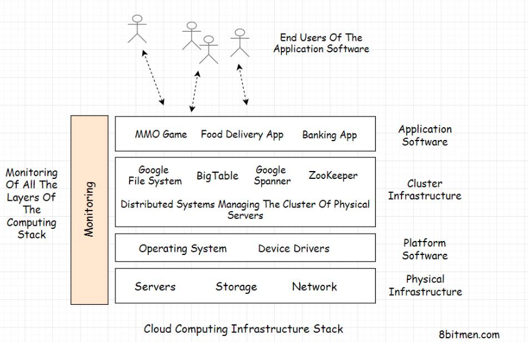

 
